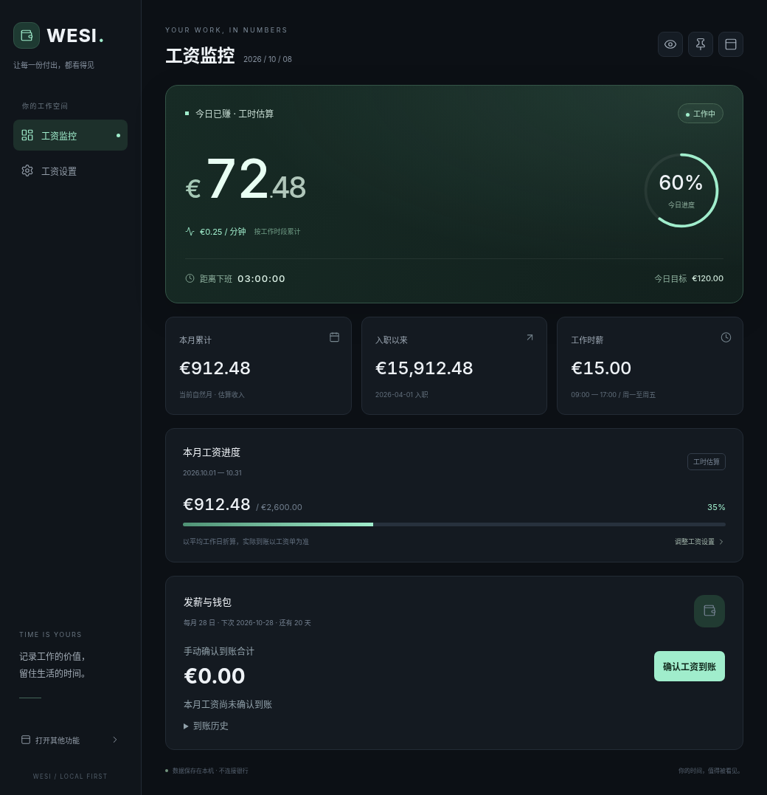

# WESI

Wage Extraction & Survival Interface

一个个人桌面系统，包含：
- 工资计时器
- 发泄战斗
- 内容库
- 塔罗
- 虚拟宠物与收集系统

默认启动新的工资监控桌面界面，使用 [NumberFlow](https://github.com/barvian/number-flow) 金额动画、[Lucide](https://github.com/lucide-icons/lucide) 图标和 pywebview。支持金额隐私、窗口置顶、紧凑视图、工作倒计时和工资设置。

发薪日默认每月 28 日，可在设置中调整为 1–31 日；短月使用月末，不自动因周末提前或顺延。工资月份与实际到账日期分别记录，每个工资月份只能确认一次，金额以整数分保存。确认成功后金币飞入钱包；可关闭动画，隐藏金额或系统减少动态效果时也不播放。钱包合计为手动确认记录的总额，不是银行余额。当前不支持分笔到账或记录编辑，确认前请核对金额和月份。组件、字体与授权说明见 [ui/THIRD_PARTY.md](ui/THIRD_PARTY.md)，运行无需 Node.js 或联网下载美术资源。



推荐 Python 3.12。Windows 在项目目录执行：

```powershell
python -m venv .venv
.\.venv\Scripts\python.exe -m pip install -r requirements.txt
.\.venv\Scripts\python.exe main.py
```

Windows 使用系统 Edge WebView2；缺少运行时可从 [微软官网](https://developer.microsoft.com/microsoft-edge/webview2/) 安装。当前版本已在 Linux Qt 后端验证，Windows 外观仍需本地验收。

Linux 需要图形显示、Tk 与 Qt 平台依赖：

```bash
python -m venv .venv
.venv/bin/python -m pip install -r requirements-linux-ui.txt
QT_API=pyside6 .venv/bin/python main.py
```

点击“打开其他功能”切换到原来的 Tk 界面，或运行 `python main.py --classic`。切换时会关闭工资监控窗口，避免两个界面同时写入存档。

工资设置支持周一至周五的当日上下班时段，默认 09:00–17:00，只在该时段内累计。
日收入按 `月净收入 × 12 ÷ (52 × 5)` 估算，再按当日班次时长均摊；显示流速与累计使用同一算法。
入职前、周末、上班前和下班后不增长。修改工资或班次会重新估算历史累计；当前不包含节假日、午休、跨夜班次或调薪历史。

默认沿用 `data/app_state.json` 和 `data/tarot_history.json`，保留旧存档。
可以设置 `WESI_DATA_DIR` 指向独立的可写目录，隔离存档、诗词缓存和新导入的头像/宠物图片。
新目录默认创建新档，不自动复制个人数据。JSON 原子写入；遇到无法解析或不兼容的存档会先保留 `.invalid-*.bak` 备份。
备份应妥善保留，程序不会自动恢复它们。

塔罗默认读取仓库内的 `data/tarot.json` 并映射已有的 78 张牌面；如存在有效的 `data/tarot_cards_zh.json` 则优先使用。
需要导出中文牌库时可运行：

```bash
python tools/make_tarot_json.py --output /tmp/wesi-tarot-cards.json
```

诗词接口不可用时会回退到本地内容；网络请求在后台执行，不阻塞窗口。
宠物摸鱼不依赖宠物窗口：关闭窗口仍会完成，退出程序后再次打开会恢复未完成的一次任务。

新版工资监控不包含游戏币或收取玩法，显示的是工资估算，并非银行实际到账记录。月度进度按自然月估算；尚未接入真实发薪周期或银行接口。
旧版像素钱罐仍保留在经典界面，原有 `salary_display` 存档保持兼容。其 Kenney CC0 素材授权位于 `assets/salary/`。

回归检查（GUI 检查自动使用临时存档，不修改个人数据）：

```bash
# 在可用的图形显示下运行全部检查；无 DISPLAY 时 GUI 检查会跳过
python -m unittest discover -s tests -v
```

真实 WebView 检查（临时存档，需要图形显示）：

```bash
python tools/check_webview.py
# Linux Qt 后端
QT_API=pyside6 python tools/check_webview.py --gui qt
```

前端交互检查和组件重建方法见 [ui/THIRD_PARTY.md](ui/THIRD_PARTY.md)。

第一轮代码审阅与后续计划见 [docs/REVIEW.md](docs/REVIEW.md)。
